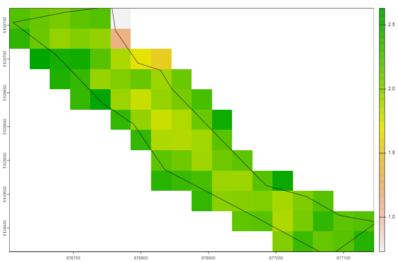

# Plan d'analyse - Suivi de la reforestation à l'aide de l'imagerie satellite

## Ressources techniques:

- [Using rstac and CQL2 to query STAC APIs](https://stacspec.org/en/tutorials/2-using-rstac-and-cql2-to-query-stac-api/)
- [Microsoft planetary computer dataset catalog](https://planetarycomputer.microsoft.com/catalog)
- [Landsat 4-7 c2l2 science product guide](https://d9-wret.s3.us-west-2.amazonaws.com/assets/palladium/production/s3fs-public/media/files/LSDS-1618_Landsat-4-7_C2-L2-ScienceProductGuide-v4.pdf) with description of the `qa_pixel` band on table 5-6 page. 15.
- [Landsat 8-9 c2l2 science product guide](https://d9-wret.s3.us-west-2.amazonaws.com/assets/palladium/production/s3fs-public/media/files/LSDS-1619_Landsat8-9-Collection2-Level2-Science-Product-Guide-v6.pdf) with description of the `qa_pixel` band on table 6-3 page. 14.
- [Documentation de l'algorithme LandTrendr](https://emapr.github.io/LT-GEE/landtrendr.html) qui a servi d'inspiration à ce protocole.

## Résumé

Des terrains aux propriétés et au couvert différent (sol nus, terrain herbeux, boisé plus ou moins haut, divers ou dense) ont différentes propriétés de réflectance, ce qui peut être suivi grâce à différents indices spectraux. 

Dans le cadre de projets de reforestation, ces indices spectraux peuvent être mis à profit pour suivre dans le temps les propriétés des boisés résultant, et d'évaluer le succès de ces projet de reforestation (voir par exemple [Liu et coll., 2019](https://cdnsciencepub.com/doi/10.1139/x90-172)). 

Dans un premier temps, et dans un objectif exploratoire, un certain nombre d'indices spectraux de base sont mesurés à partir des bandes de données de refléctance panchromatiques et multispectrales, produits par les programmes Landsat et Sentinel 2:

- L'indice de végétation par différence normaliée - $NDVI = \frac{NIR - RED}{NIR + RED}$ (Rouse et l., 1974)
- L’indice de végétation amélioré - $EVI = 2.5\frac{NIR - RED}{NIR + 6RED - 7.5 BLUE + 1}$ (Liu and Huete 1995)
- Le ratio simple (Simple Ratio) - $SR = \frac{NIR}{RED}$ (Jordan et coll., 1969)
- Le ratio infrarouge : vert - $GR = \frac{NIR}{GREEN}$ (Lyon et coll., 1998)
- Le ratio vert : rouge - $VI = \frac{GREEN}{RED}$ (Kanemasu, 1974)
- L'indice de végétation ajusté pour le sol (Soil-Adjusted Vegetation Index) - $SAVI = \frac{NIR - RED}{NIR + RED + L}$ (Huete 1988)
- L'indice de stress d'hydratation (Moisture Stress Index) - $MSI = \frac{SWIR}{NIR}$ (Wolter et coll., 2009)
- (Standard Vegetation Index) - $SVR = \frac{SWIR}{(RED+GREEN) / 2}$ (Wolter et coll., 2009)
- (Global Environment Monitoring Index) - $GEMI = \eta(1 - 0.25\eta) - \frac{RED - 0.125}{1 - RED}$ où $\eta = (2(NIR^2 - RED^2) + 1.5NIR + 0.5RED) / (NIR + RED + 0.5)$ (Verstraete and Pinty 1996)

Dans les formules ci-dessus, $NIR$ réprésente la bande des infrarouges, $RED$, $GREEN$ et $BLUE$ représentent respectivement les bandes rouges, vertes et bleue et $SWIR$ désigne la bande d'infrarouge à ondes courtes. 

Pour l'étape d'exploration et de calibration, ces indices sont mesurées pour des parcelles dont on connaît la dynamique de reforestation et qui sont suivies en parallèle sur le terrain (sites chronoséquence). 

## Sites suivis

### Sites cibles

Les sites cibles font référence aux sites qui ont été identifiés pour être reforestés mais qui ne le sont pas encore. Ces sites sont des coulées agricoles, c'est à dire des sites en contexte agricole mais non cultivés eux même à cause de contraintes à l'exploitation (pente, proximité à une berge). Ces sites sont généralement étroits et en bord d'un cours d'eau. 

Source de donnée pour les sites cibles:
- sites identifiés dans le contexte du projet "Demain la Forêt"

> [!NOTE]
> En attente des données pour les polygones associés à ces sites.

### Sites "chronoséquence"

Les sites de référence "chronoséquence" sont les sites identifiés comme étant d'anciennes coulées agricoles qui sont en cours de reforestation. Ces sites ont été identifié dans le cadre de ce projet et sont aussi monitorés pour leur biodiversité (audiomoths). Pour chacun de ces sites, les polygones délimitant les coulées ont été dessinés à la main sur Q-GIS. Seulement certains de ces sites ont une durée de reforestation associée.

Localisation des données:  
- les points de localisation de ces sites sont ici: `P:\Projets\Actif\2023_ECCC4_Biodiv\3-Analyses\1-Data\IEQM\Coulées agricoles - suivi de biodiversité (1).kml`
- les polygones associés ont été dessinés approximativement et sont stockés ici: `1-Data\PlantationSites\target_sites_coulees.shp`

### Sites de référence "matures"

Les sites de référence "matures" font référence aux sites qui n'ont pas subi de déforestation dans les 50 dernières années et qui se trouvent dans le même paysage que les sites cibles et chronoséquence. Ils sont choisis pour ressembler le plus fidèlement possible à ce à quoi les sites cibles et chronoséquences devraient ressembler s'ils n'avaient pas été déforestés, et donc à ce à quoi ils devraient ressembler si la reforestation est un succès.

Localisation des données: 

## Suivi des indices spectraux

> [!IMPORTANT]
> - Les données SPOT 1 à 5 sont disponible mais l'acquisition des données est concentrée en très grande partie sur l'Europe, donc pas vraiment intéressant pour nous.
> - Les données Landsat-7 présentent des artefacts, il faut voir comment on peut les détecter et/ou les nettoyer

Pour chaque site, les dynamiques sont suivies entre 1984 (lancement Landsat 4) et 2024 en utilisant les programmes d’imagerie satellite suivant : 
-	LANDSAT (4 à 9) – Résolution de 30m, 1984 à aujourd’hui.
-	Sentinel-2 – 2015 à aujourd’hui, résolution de 10m (20m pour la bande SWIR).

Note : Le produit harmonisé Landsat-Sentinel offre une plus grande fréquence de bande entre 2015 et aujourd’hui, à une résolution de 30m.

Deux images (propre – sans nuage) par ans au minimum, tous les ans : une pour l’été (ou une image moyenne entre le 1er juillet et le 31 aout) et une pour l’automne (ou moyenne entre le 15 septembre et le 15 octobre)

## Dynamique des sites 

Exemple ici sur le polygone ouest du site décrit par la photo satellite
ci-dessus (site chronoséquence). La méthodologie sera étendue sur chaque site.

Extraction des bandes nécessaires (par ex. pour l'EVI les bandes rouges, bleues
et infrarouge proche), pour chaque année entre le 1er juillet et le 15
septembre, avec une couverture nuageuse de moins de 10%. Pour certaines années,
aucune image ne correspond, pour d'autres il y a plusieurs images, associées à
des dates de passages différentes du même satellite, ou parfois au passage de
satellites différents, aux mêmes dates ou à des dates différentes. 

Pour chacune des bandes, on utilise un masque créé avec la bande de quality
assessment (`qa_pixel`) pour supprimer tous les pixels qui sont couverts par des
nuages ou des ambres.

Une nouvelle bande composite est créée en utilisant la formule de l'indice
spectrale que l'on veut calculer et les bandes nettoyées. Si plusieurs dates de
passage sont disponible, l'indice est calculé pour chacune des dates.

| SITE_ID | YYYY_MM_DD | PROGRAM | INDEX_NAME | INDEX_MEAN | INDEX_MED | INDEX_VAR |
|---|---|---|---|---|---|---|
|Numéro unique d'indentification du polygone|Date d'acquisition de l'image|Nom et numéro du programme d'acquisition de l'image|Nom (acronyme) de l'indice spectrale calculé| Valeur moyenne de l'indice spectrale pour ce site/date| Valeur médiane de l'indice spectrale pour ce site/date|Mesure de variabilité de l'indice spectrale pour ce site/date|

La bande créé ressemble à quelque chose comme (ici pour l'été 1884, programme
Landsat-4):

> [!NOTE]
> Étant donné que les transition de couverture du sol sont assez abruptes en contexte agricole et au vu de la résolution grossière des données il serait probablement plus intéressant de masquer tous les pixels qui ne sont pas au moins à 75% dans le polygone, au lieu de garder comme ici tous les pixels qui touchent le polygone.

Le but est de créer des dynamiques temporelles comme celle ci-dessous (extrait de la documentation de `LandTrendR`) pour
chaque site et chaque indice:

Ces dynamiques nous permettront de faire une première exploration de la
robustesse des différents indices spectraux, et donc potentiellement de
sélectionner les plus intéressant. Sur ces indices, on pourra fitter des modèles
appropriés dont les statistiques pourront potentiellement nous donner des
information sur la dynamique de régénération des sites (par ex. la détéction du
plateau sur la dynamique d'un indice pourrait nous permettre de détecter l'année
de fermeture de la canopé, alors que d'autres indices pourraient continuer à
augmenter même après la fermeture de canopé, nous informant sur la croissance du
boisé).
